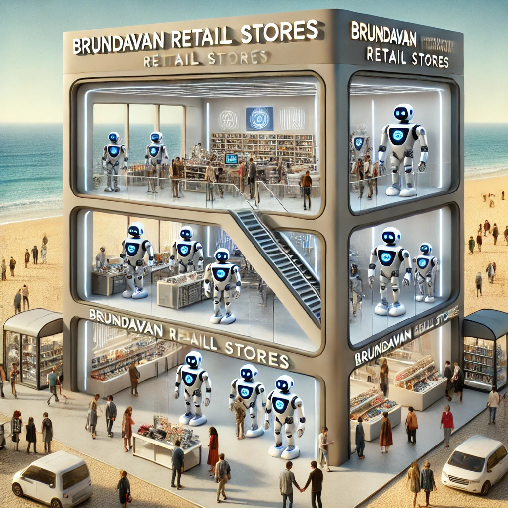

# SQL Data Analysis Project

# Project Title

## Power BI Report
You can view the interactive Power BI report by clicking the link below:

[View Power BI Report](https://app.powerbi.com/view?r=eyJrIjoiZGZlODI4MTAtMWFiNy00MDU3LWJkZjAtZGExYjMyMjk0M2YzIiwidCI6ImEyZWE5ODRlLTlkYzYtNDU5ZS1iNDFkLTY1YWJmYWEzMTExYyJ9)

## Project Overview
This project involves performing an end-to-end SQL data analysis on a retail sales dataset. The goal is to extract meaningful insights from the data by answering a series of business questions. The analysis will cover various SQL topics ranging from basic to advanced.

## Datasets
The project uses the following datasets:

1. **Customers Data**: Contains information about customers, including demographics and purchase behavior.
   - **File**: `customers.csv`
   - **Columns**: Customer ID, Age, Gender, Name, Income Level, Location, Loyalty Program, Purchase Frequency, Mail ID

2. **Date Data**: Provides date-related details for transactions.
   - **File**: `date.csv`
   - **Columns**: Date, Year, Month, Day, Day of Week, Quarter, Week of Year, Is Weekend

3. **Products Data**: Includes information about products available in the stores.
   - **File**: `products_data.csv`
   - **Columns**: Product ID, Product Name, Category, Subcategory, Supplier ID, Cost Price, Retail Price

4. **Retail Sales Data**: Contains detailed records of sales transactions.
   - **File**: `retail_sales_data.csv`
   - **Columns**: Transaction ID, Date, Time, Store ID, Product ID, Quantity Sold, Price per Unit, Total Sales, Discount, Payment Method, Customer ID

5. **Sales Targets Data**: Provides monthly sales targets for each store.
   - **File**: `sales_targets.csv`
   - **Columns**: Target ID, Store ID, Year, Month, Sales Target Amount

6. **Store Details Data**: Contains information about the stores in the dataset.
   - **File**: `store_details.csv`
   - **Columns**: Store ID, Store Location, Store Size, Store Manager, Opening Date

## Download Datasets
You can download the datasets from the following link:
- [Download CSV Files](./data)

## Getting Started
1. Load the provided CSV files into your SQL database.
2. Review the data structure and relationships between the tables.
3. Begin answering the business questions provided in the `questions.txt` file.

## Business Questions
The project is structured into three levels of business questions:
1. **Basic**: Questions covering foundational SQL concepts.
2. **Intermediate**: Questions involving more complex SQL operations.
3. **Advanced**: Challenging questions requiring advanced SQL techniques.

The `questions.txt` file contains all the questions categorized by level.

## License
This project is for educational purposes. Feel free to use the datasets and code provided in this repository.

